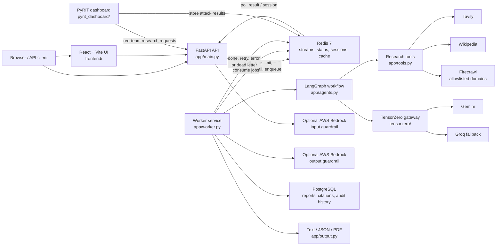

# Autonomous Multi-Agent Research Platform

This project is a real-time research and reporting service. Each request can use live Tavily, Wikipedia, and Firecrawl evidence, then passes that evidence through a LangGraph workflow:

```text
FastAPI → Redis Stream → LangGraph plan → live search tools
                         ↓
             structured evidence and citations
                         ↓
              Summarizer → Writer → Critic
                         ↓
                 bounded revision loop
                         ↓
                  text / JSON / PDF report
```

PostgreSQL stores ordinary report records, metadata, citations, and audit history. Redis stores jobs, short-term sessions, status, and an optional exact-query cache. The research workflow does not use embeddings, pgvector, or vector retrieval.

## Architecture

### Runtime topology



The API and worker are separate processes so HTTP traffic can scale independently from research jobs. Docker Compose runs them as separate services; the API can also start an in-process worker for local or backward-compatible deployments.

### Request lifecycle

1. A browser or API client submits `POST /research` with a topic and optional session/output format.
2. FastAPI authenticates the request, applies rate limiting and input guardrails, records the user message, and pushes a job to a Redis Stream.
3. The worker claims the job, recovers abandoned jobs when needed, and runs the LangGraph workflow.
4. The research agents plan the work, collect evidence from Tavily, Wikipedia, and optionally allowlisted Firecrawl pages, then summarize the evidence and write a cited report.
5. The critic checks the draft. Failed checks enter a bounded revision loop; exhausted retries go to the Redis dead-letter stream.
6. The worker applies output guardrails, stores report metadata and citations in PostgreSQL, stores status/results in Redis, and optionally creates JSON or PDF output.
7. The client polls `GET /result/{job_id}`. The API reads the result from Redis and returns the completed report, citations, diff, and requested output.

### Service responsibilities

| Service or area | Responsibility | Main location |
|---|---|---|
| Frontend | React/Vite chat interface; production assets are built into the API image | `frontend/` |
| API | Authentication, sessions, rate limiting, job submission, result endpoints, and static frontend serving | `app/main.py` |
| Worker | Redis Stream consumption, retries, abandoned-job recovery, and report execution | `app/worker.py`, `app/queue.py` |
| Research graph | Planning, search routing, summarization, writing, citations, and critic/revision loop | `app/agents.py` |
| Tool layer | Tavily, Wikipedia, and bounded Firecrawl access with URL validation and rate limits | `app/tools.py` |
| Redis | Job stream, job status, sessions, rate limits, optional exact-query cache, and PyRIT results | Docker Compose / AWS ElastiCache |
| PostgreSQL | Ordinary report records, metadata, citations, and audit history; no vector database | `app/memory.py` |
| TensorZero | LLM gateway and model routing for Gemini and Groq | `tensorzero/` |
| PyRIT | Authenticated red-team dashboard and scheduled attack runner | `pyrit_dashboard/` |
| Infrastructure | Local containers and AWS VPC, ECS, Redis, PostgreSQL, ECR, Secrets Manager, Bedrock, and EventBridge | `docker-compose.yml`, `terraform/` |

The API image uses a multi-stage build: Vite creates `frontend/dist`, which is copied to `frontend-dist` and served by FastAPI. If no production build is present, FastAPI falls back to the root `index.html`.

## Components

The React/Vite chat UI lives in the frontend directory and is served by the API container after the production build.

- `app/agents.py` — LangGraph orchestration, four agents, tool routing, citation handling, and critic loop.
- `app/tools.py` — Tavily, Wikipedia, and Firecrawl clients with timeouts, URL validation, allowlists, and structured evidence.
- `app/main.py` — FastAPI API and optional in-process worker.
- `app/worker.py` — standalone worker entry point for Docker Compose or a separate ECS worker.
- `app/memory.py` — Redis sessions and ordinary PostgreSQL report records; no vector schema.
- `app/queue.py` — Redis Streams, retries, abandoned-message recovery, and dead-letter handling.
- `pyrit_dashboard/` — authenticated PyRIT dashboard plus a one-shot scheduled runner.
- `tensorzero/` — LLM routing and system prompts.
- `terraform/` — AWS infrastructure. The scheduled PyRIT task runs `scheduled_run.py`, not the persistent dashboard server.

## Local setup

Use Python 3.12 consistently.

```powershell
Copy-Item .env.example .env
# Add GEMINI_API_KEY, GROQ_API_KEY, TAVILY_API_KEY and, optionally, FIRECRAWL_API_KEY to .env
docker compose up --build
```

The React UI is available at http://localhost:8000. For frontend-only development, run
npm install and npm run dev from the frontend directory; Vite proxies API calls to port 8000.

The API is available at `http://localhost:8000`. Submit a job:

```powershell
curl -X POST http://localhost:8000/research `
  -H "Content-Type: application/json" `
  -H "X-API-Key: local-dev-key" `
  -d '{"topic":"Recent developments in quantum computing","output_format":"json"}'
```

Then poll the returned job ID:

```powershell
curl http://localhost:8000/result/<job-id> -H "X-API-Key: local-dev-key"
```

Wikipedia works without an API key. Tavily is needed for current web search. Firecrawl is only enabled when `FIRECRAWL_ALLOWED_DOMAINS` is configured; this prevents uncontrolled scraping.

## Configuration

Copy `.env.example` to `.env`. Important settings include:

| Variable | Purpose |
|---|---|
| GEMINI_API_KEY | Primary Google AI Studio Gemini key, mapped to TensorZero |
| GROQ_API_KEY | Fallback Groq key |
| `TAVILY_API_KEY` | Current web search |
| `FIRECRAWL_API_KEY` | Page scraping |
| `FIRECRAWL_ALLOWED_DOMAINS` | Required Firecrawl domain allowlist |
| `GUARDRAILS_ENABLED` | Enable AWS Bedrock Guardrails |
| `API_KEY` | Main API authentication |
| `PYRIT_API_KEY` | PyRIT dashboard authentication |
| `CACHE_REPORTS` | Optional exact-query report cache; defaults to `false` |
| `START_WORKER` | Starts the worker in the API process; Compose uses a separate worker |

In production, set `AWS_SECRETS_MANAGER_SECRET_ID` and load configuration from AWS Secrets Manager. Local startup does not contact AWS during module import.

## Testing

Install test dependencies and run:

```powershell
python -m pip install -e ".[test]"
python -m pytest -q
```

Tests should mock Tavily, Wikipedia, Firecrawl, TensorZero, Redis, PostgreSQL, and Bedrock. Paid external APIs are not required for the test suite.

## AWS deployment

Terraform keeps the existing VPC, ECS, Redis, PostgreSQL, ECR, Secrets Manager, Bedrock, and CloudWatch structure. Before applying infrastructure:

1. Put production provider keys in Secrets Manager rather than source code.
2. Configure GitHub Actions with the `AWS_ROLE_TO_ASSUME` OIDC secret; long-lived AWS access keys are not used by the workflow.
3. Configure `FIRECRAWL_ALLOWED_DOMAINS` deliberately.
4. Configure HTTPS through `acm_certificate_arn`.
5. Restrict `ALLOWED_ORIGINS` to the real frontend origin.
6. Keep the PyRIT dashboard private or place it behind an authenticated internal access path. Port 8001 is no longer exposed through the public load balancer.

The weekly EventBridge target launches the PyRIT image with the `scheduled_run.py` command, which executes real PyRIT `PromptSendingAttack` runs and exits. The dashboard remains a separate long-running service for controlled access.

## Known limitations

- Firecrawl performs bounded page scraping, not unrestricted crawling. `FIRECRAWL_MAX_DEPTH` is reserved for future crawl support and is currently `0`.
- The current report writer uses citation IDs such as `[S1]`; the critic rejects unknown IDs.
- The API task can run its own worker for backward compatibility, but production deployments should use the standalone worker service pattern to scale API and processing independently.
