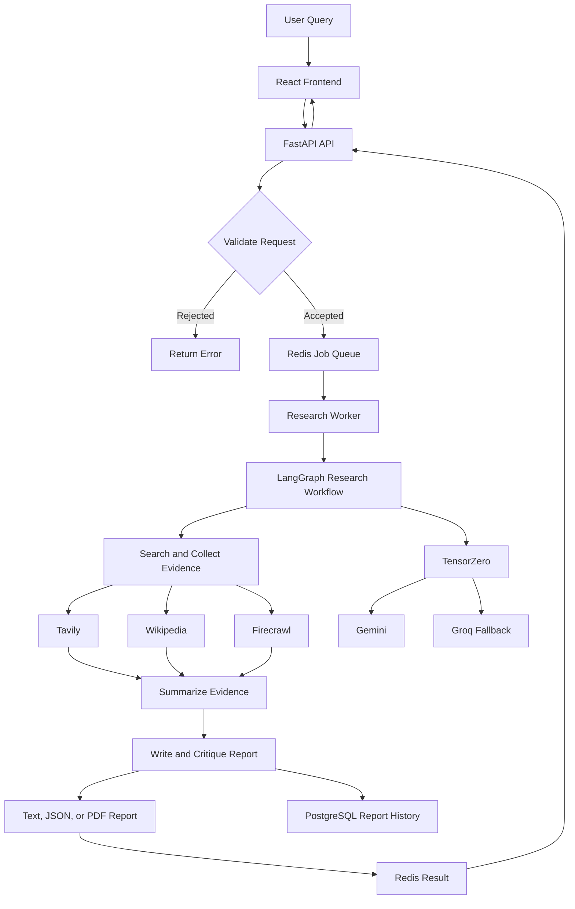

# Autonomous Multi-Agent Research Platform

This project is a real-time research and reporting service. It accepts questions through FastAPI, processes them in the background with a worker and LangGraph, gathers live evidence from search tools, and returns cited text, JSON, or PDF reports.

PostgreSQL stores ordinary report records, metadata, citations, and audit history. Redis stores jobs, short-term sessions, status, and an optional exact-query cache. The research workflow does not use embeddings, pgvector, or vector retrieval.

## Architecture

The platform takes a research question, gathers information from trusted sources, creates a cited report, and returns it to the user.



The API and worker run separately so user requests stay responsive while research is processed in the background. Redis stores jobs and results, PostgreSQL stores report history, and TensorZero routes requests to the configured language models.

## Components

The React/Vite chat UI lives in the frontend directory and is served by the API container after the production build.

- `app/agents.py` — LangGraph orchestration, four agents, tool routing, citation handling, and critic loop.
- `app/tools.py` — Tavily, Wikipedia, and Firecrawl clients with timeouts, URL validation, allowlists, and structured evidence.
- `app/main.py` — FastAPI API and optional in-process worker.
- `app/worker.py` — standalone worker entry point for Docker Compose or a separate ECS worker.
- `app/memory.py` — Redis sessions and ordinary PostgreSQL report records; no vector schema.
- `app/queue.py` — Redis Streams, retries, abandoned-message recovery, and dead-letter handling.
- `pyrit_dashboard/` — authenticated PyRIT dashboard plus a one-shot scheduled runner.
- `tensorzero/` — LLM routing and system prompts.
- `terraform/` — AWS infrastructure. The scheduled PyRIT task runs `scheduled_run.py`, not the persistent dashboard server.

## Local setup

Use Python 3.12 consistently.

```powershell
Copy-Item .env.example .env
# Add GEMINI_API_KEY, GROQ_API_KEY, TAVILY_API_KEY and, optionally, FIRECRAWL_API_KEY to .env
docker compose up --build
```

The React UI is available at http://localhost:8000. For frontend-only development, run
npm install and npm run dev from the frontend directory; Vite proxies API calls to port 8000.

The API is available at `http://localhost:8000`. Submit a job:

```powershell
curl -X POST http://localhost:8000/research `
  -H "Content-Type: application/json" `
  -H "X-API-Key: local-dev-key" `
  -d '{"topic":"Recent developments in quantum computing","output_format":"json"}'
```

Then poll the returned job ID:

```powershell
curl http://localhost:8000/result/<job-id> -H "X-API-Key: local-dev-key"
```

Wikipedia works without an API key. Tavily is needed for current web search. Firecrawl is only enabled when `FIRECRAWL_ALLOWED_DOMAINS` is configured; this prevents uncontrolled scraping.

## Configuration

Copy `.env.example` to `.env`. Important settings include:

| Variable | Purpose |
|---|---|
| GEMINI_API_KEY | Primary Google AI Studio Gemini key, mapped to TensorZero |
| GROQ_API_KEY | Fallback Groq key |
| `TAVILY_API_KEY` | Current web search |
| `FIRECRAWL_API_KEY` | Page scraping |
| `FIRECRAWL_ALLOWED_DOMAINS` | Required Firecrawl domain allowlist |
| `GUARDRAILS_ENABLED` | Enable AWS Bedrock Guardrails |
| `API_KEY` | Main API authentication |
| `PYRIT_API_KEY` | PyRIT dashboard authentication |
| `CACHE_REPORTS` | Optional exact-query report cache; defaults to `false` |
| `START_WORKER` | Starts the worker in the API process; Compose uses a separate worker |

In production, set `AWS_SECRETS_MANAGER_SECRET_ID` and load configuration from AWS Secrets Manager. Local startup does not contact AWS during module import.

## Testing

Install test dependencies and run:

```powershell
python -m pip install -e ".[test]"
python -m pytest -q
```

Tests should mock Tavily, Wikipedia, Firecrawl, TensorZero, Redis, PostgreSQL, and Bedrock. Paid external APIs are not required for the test suite.

## AWS deployment

Terraform keeps the existing VPC, ECS, Redis, PostgreSQL, ECR, Secrets Manager, Bedrock, and CloudWatch structure. Before applying infrastructure:

1. Put production provider keys in Secrets Manager rather than source code.
2. Configure GitHub Actions with the `AWS_ROLE_TO_ASSUME` OIDC secret; long-lived AWS access keys are not used by the workflow.
3. Configure `FIRECRAWL_ALLOWED_DOMAINS` deliberately.
4. Configure HTTPS through `acm_certificate_arn`.
5. Restrict `ALLOWED_ORIGINS` to the real frontend origin.
6. Keep the PyRIT dashboard private or place it behind an authenticated internal access path. Port 8001 is no longer exposed through the public load balancer.

The weekly EventBridge target launches the PyRIT image with the `scheduled_run.py` command, which executes real PyRIT `PromptSendingAttack` runs and exits. The dashboard remains a separate long-running service for controlled access.

## Known limitations

- Firecrawl performs bounded page scraping, not unrestricted crawling. `FIRECRAWL_MAX_DEPTH` is reserved for future crawl support and is currently `0`.
- The current report writer uses citation IDs such as `[S1]`; the critic rejects unknown IDs.
- The API task can run its own worker for backward compatibility, but production deployments should use the standalone worker service pattern to scale API and processing independently.
